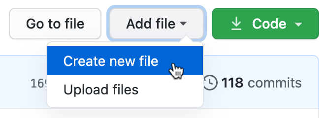
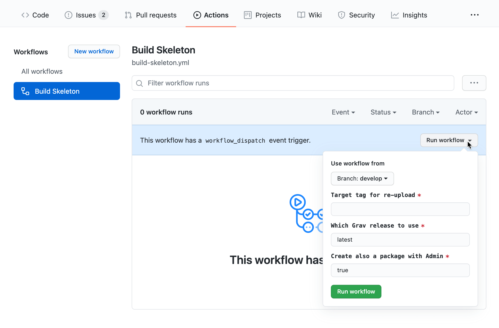

# Grav Skeleton Builder
GitHub Action to create fully functional [Grav skeleton packages](https://learn.getgrav.org/advanced/grav-development#grav-skeletons) that include all the necessary dependencies. 

This action role is only capable of creating a skeleton package, in order to automate uploading the resulting packages into your GitHub releases for GPM, you will need a full workflow as explained below.

## Setup workflow
After having made sure your repository Skeleton follows [Grav's guidances](https://learn.getgrav.org/advanced/grav-development#grav-skeletons), head over to your repository on GitHub.

1. Create a new worfklow file under `.github/workflows/build-skeleton.yaml`, GitHub simplifies this process, you can copy the path above and then click on **Add file** -> **Create new file**

    

2. Paste the following content into it and then commit:

    ```yml
    name: Build Skeleton

    on:
    release:
        types: [ published ]
    workflow_dispatch:
        inputs:
        tag:
            description: 'Target tag for re-upload'     
            required: true
            default: ''
        version:
            description: 'Which Grav release to use'
            required: true
            default: 'latest'
        admin:
            description: 'Create also a package with Admin'
            required: true
            default: true

    jobs:
    build:
        runs-on: ubuntu-latest
        steps:
        - uses: actions/checkout@v2
        - name: Extract Tag
            run: echo "SKELETON_VERSION=${{ github.event.inputs.tag || github.ref }}" >> $GITHUB_ENV
        - name: Generate Skeleton Packages
            uses: getgrav/skeleton-builder@v1
            with:
            version: ${{ github.event.inputs.version || 'latest' }}
            admin: ${{ github.event.inputs.admin || true }}
        - name: Upload packages to release
            uses: svenstaro/upload-release-action@v2
            with:
            repo_token: ${{ secrets.GITHUB_TOKEN }}
            tag: ${{ env.SKELETON_VERSION }}
            file: dist/*.zip
            overwrite: true
            file_glob: true
    ```

3. You are now ready to build your skeleton.

## How to use
The workflow in combination with this action allows to create Skeleton packages in two ways:

1. **Automatically**: every time a new release of your skeleton is published on GitHub, the workflow will run, generate the packages and upload them on your just published release.
2. **Manually**: if you don't have anything to release but you want to rebuild the packages to use the latest version of Grav or any of your Skeleton dependencies, you can use this way.

To use the automatic mode, you don't have to do anything other than follow the standard procedure of GitHub release. Once a new Release is created, the workflow will spin off.

The **Manual** mode, instead, can be reached in GitHub under **Actions** -> **Build Skeleton** -> **Run workflow**, where you will have to specify the release tag version you are targeting to rebuilt.



## Inputs
This action comes with 3 useful inputs that can be used for customizing the build

1. **version** (default: `latest`): The Grav version to utilize for building the Skeleton package. There is no reason for using anything but `latest` unless you are testing something.
2. **admin** (default: `true`): Whether a second package should be created that includes Admin. Note that when this is set to true this will generate 2 packages, one with admin and one without. 
3. **verbose** (default: `false`): Will output everything happening in the action, useful for debugging.

## Development / Debugging
This `action` comes with a built-in workflow that helps with development. By using [act](https://github.com/nektos/act), it can be entirely run locally, without the need of pushing to GitHub.

To run the action locally, open your terminal and `cd` to the location of this file, then simply run `act`.

Act will run the built-in workflow which is set to point to the `entrypoint.sh` file at this location. Any change applied to the file can be tested by re-running `act`.